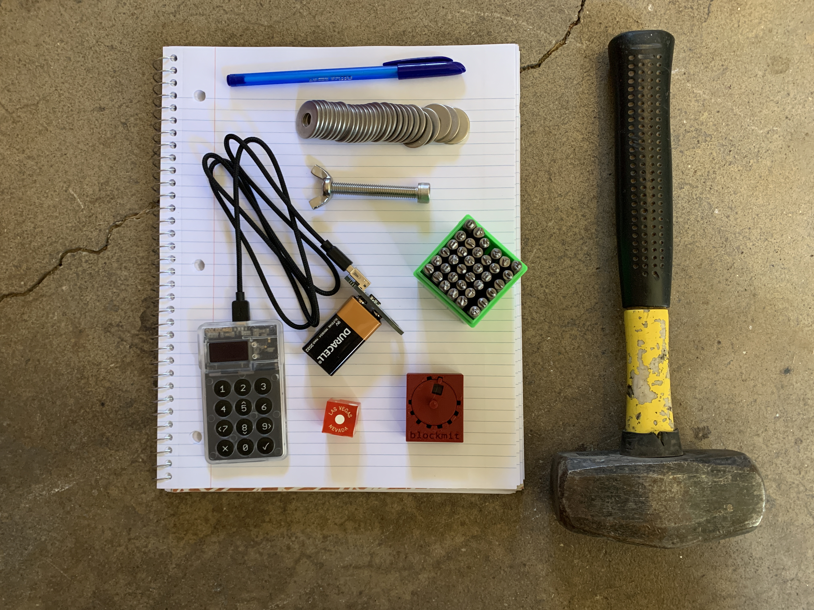

# Materials
That's enough rambling from me about self-custody, let's get on with the article. The following describes how to verify the latest version of the ColdCard firmware is being used; how to generate a new seed with 256 bits of entropy using a 6-sided dice; how to verify that the ColdCard is actually deriving seed words from the user's unique dice rolls; how to backup that seed phrase into stainless steel washers using the Blockmit 3D printed jig; and finally, stress testing the backup. To get started, there are few necessities. If you're following along at home, gather the following items:

1. Paper Notebook.
2. Writing Utensil.
3. Hammer.
4. Six-sided dice, preferably a balanced casino dice.
5. [ColdCard](https://coldcardwallet.com/) with cable, power adaptor, & battery.
6. [Blockmit](https://twitter.com/blockmit_com) 3D Printed Jig. Available at [CryptoCloaks.com](https://www.cryptocloaks.com/product/blockmitjig/)
7. [Letter & Number Stamp Set](https://www.amazon.com/gp/product/B06XCZ3TDG/ref=ppx_yo_dt_b_asin_title_o00_s00). 3mm (1/8").
8. [Stainless Steel Washers](https://www.amazon.com/gp/product/B00FAVBPJY/ref=ppx_yo_dt_b_asin_title_o02_s00). 8mm I.D. x 24mm O.D. x 2mm thick.
9. [Stainless Steel Wingnuts](https://www.amazon.com/gp/product/B07QF25BLH/ref=ppx_yo_dt_b_asin_title_o04_s00). M8-1.25
10. [Stainless Steel Bolts](https://www.mcmaster.com/91292A209/). M8-1.25 x 60mm.

I already had a notebook, pen, hammer, dice, and ColdCard at home so I spent about $65.00 gathering the other materials, which was enough to make four of these backups which come out to less than $17.00 each.
