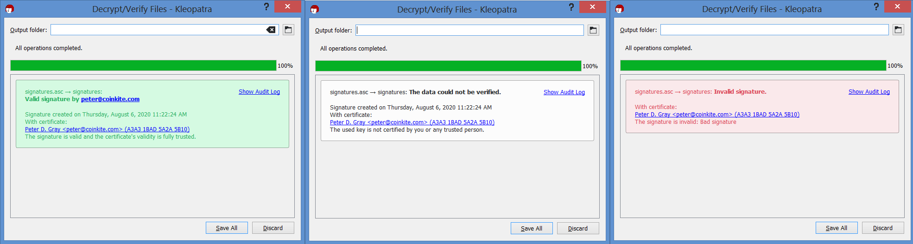

# Verifying & Updating the COLDCARD Firmware
First, the firmware on the ColdCard can be updated if it isn't the latest version. The latest version can be found on ColdCard's website, [here](https://coldcardwallet.com/docs/upgrade). I will demonstrate how I verify the firmware file on Windows using Kleopatra. 

Basically what will be happening here is: download the CoinKite public PGP, save it as an .asc file, import that key to Kleopatra, then use that key to verify the clear-signed text file to confirm the hash value of the firmware file, and then finally independently generate a sha256 hash value to compare with the verified hash value online. 

Navigate to [this link](https://coldcardwallet.com/docs/upgrade) and click on the hyperlink with the latest firmware version, this should automatically start the download of the file.

Next, scroll down to the Advanced: Verify Your Downloads section. Once there, click on the hyperlink that reads: 

["4589779ADFC14F3327534EA8A3A31BAD5A2A5B10"](https://keyserver.ubuntu.com/pks/lookup?op=get&search=0xA3A31BAD5A2A5B10)

Clicking on that hyperlink will bring the user to the plaintext html page which contains the public PGP key for [peter@coinkite](https://twitter.com/DocHex). Press ctrl+s to save the PGP public key. 

Ensure that the "all files" type is selected so that the file can be saved with the .asc extension. If it is saved as a .txt file, it will not work. I simply named the file "peter@coinkite.asc" and saved it to the same file location the firmware file was downloaded. 

Once saved, the .asc file should have a lock icon, that is how the user knows it will work with Kleopatra.

Now that the PGP public key is saved to the PC, it needs to be imported to Kleopatra. If you have not used Kleopatra before, you will need to establish your own PGP key. For information on the GPG4Win suite of tools, including Kleopatra and to learn how to use them and download them, start here: https://www.gpg4win.org/documentation.html

In Kleopatra, click on the *Import* icon.

Navigate to the file location that the peter@coinkite.asc file is saved and select that file. Kleopatra will generate a prompt informing the user that the PGP public key being imported will need to be certified. In order to verify this really is the right PGP public key, another source can be used such as https://keybase.io/DocHex. Now the fingerprint on the certification window can be compared with the fingerprint displayed on KeyBase.

Once the PGP public key has been imported it will be displayed in the list on Kleopatra.

Now that the PGP public key is imported and certified, navigate back to: https://coldcardwallet.com/docs/upgrade and scroll down to the Advanced: Verify Your Downloads section again. This time, click on the hyperlink for the clear-signed text file.

Clicking on that hyperlink will bring the user to the plain text html page which contains all of the ColdCard wallet firmware files and their corresponding SHA256 hash values. Again, hit ctrl+s to save this, ensure the file type is set to all types, and then save it to the PC as an .asc file.

Once the file is saved, then right-click and select *More GpgEX options* > *Verify*

Kleopatra will automatically find and use the CoinKite key and produce the valid dialog box. It's important to understand the visual difference between a valid result from a certified key, a valid result from a non-certified key, and a failed verification with a signature that doesn't match the public key.

Once the result is a valid signature, it can be said with confidence that the data contained in the clear-signed text is true and accurate. This means that the sha256 hash value next to the firmware version should be the same as the hash value of the .dfu firmware file that was downloaded earlier. 

To generate and verify checksums like sha256, I use a program called HxD, which can be found here: https://mh-nexus.de/en/hxd/.

Open HxD and then select Open File and navigate to the file location that the .dfu firmware file is saved. Once that file is open, select the Analysis tab and choose Checksums from the drop-down menu, then select SHA-256 in the pop-up window.

Now the sha256 hash value has been independently generated on the downloaded .dfu firmware file. This hash value can be compared with the hash value on the clear-signed text webpage knowing that the information contained on that clear-signed text page was in fact signed by CoinKite which was verified with the PGP public key.

Now the .dfu file can be saved to a microSD card, inserted into the ColdCard and the update can be made to the latest version. If this is the first time turning on the ColdCard, then proceed through all the setup steps of establishing a PIN & anti-phishing words, ect.
