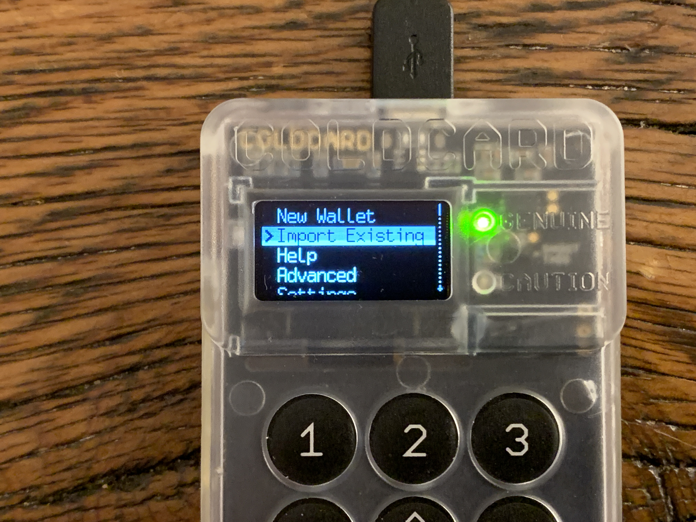
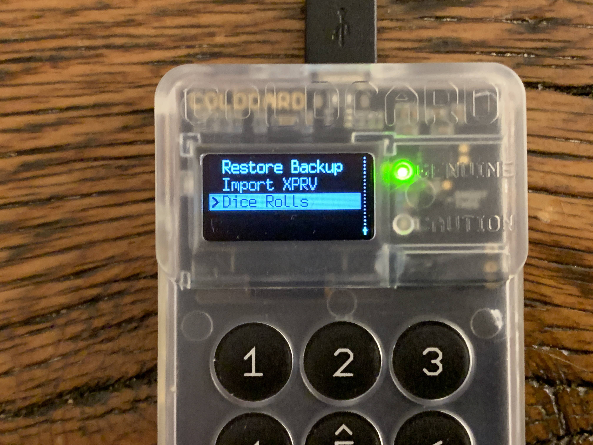
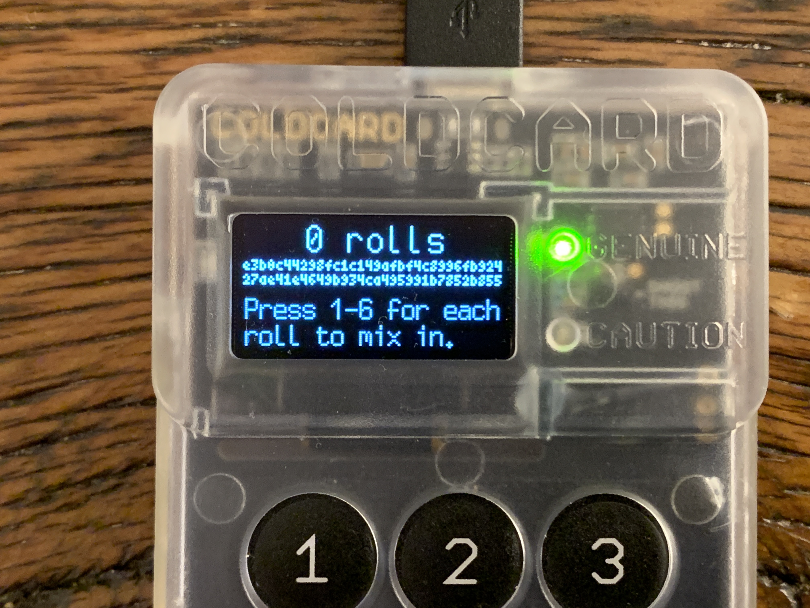
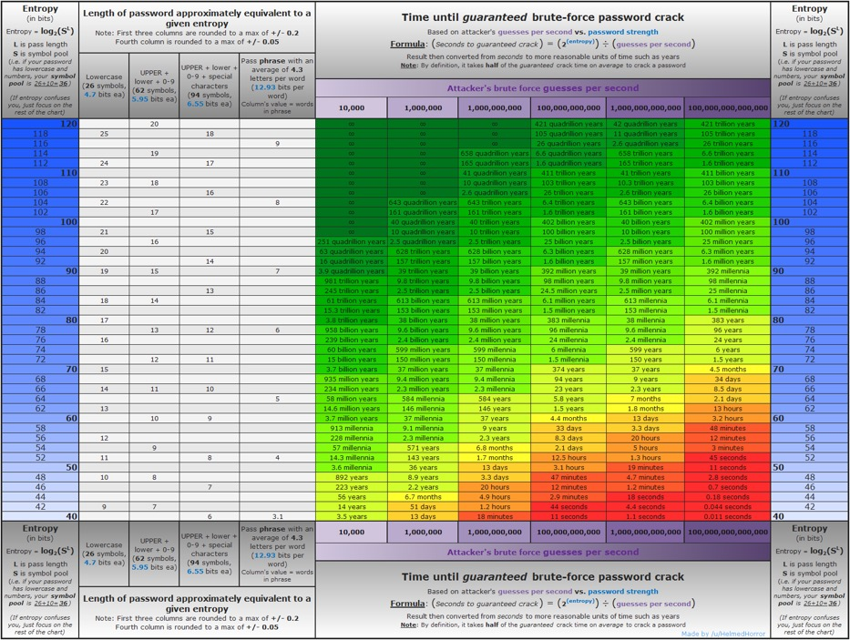
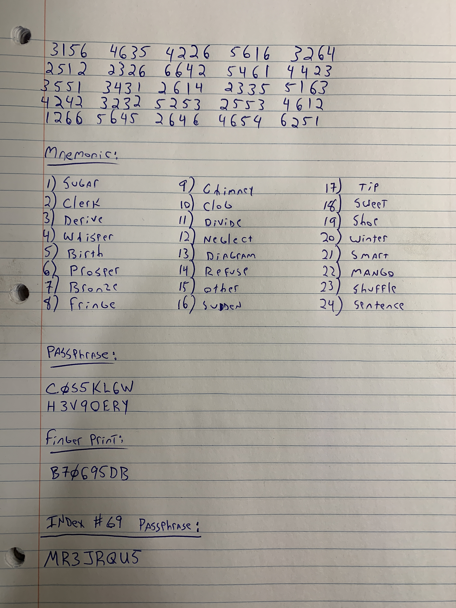
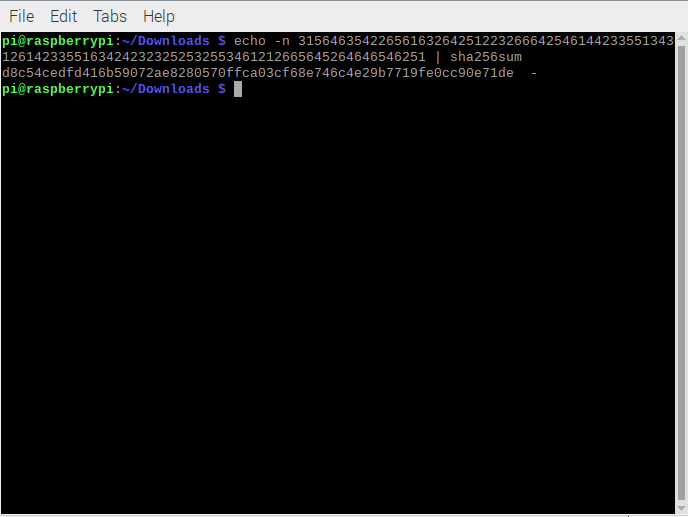
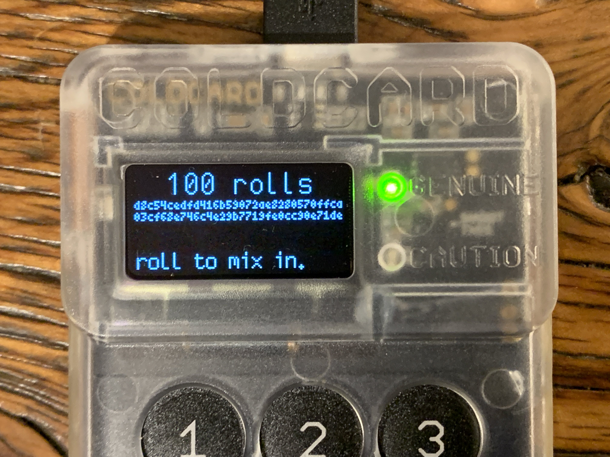
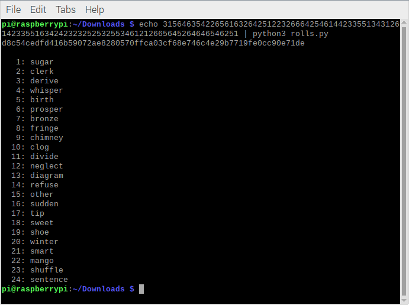

# Verifying Dice Rolls with the COLDCARD
Once the PIN is set on the ColdCard,  navigate to Import Existing > Dice Rolls.

Once there, the "0 rolls" screen will always be displayed with the hash value, e3b0c... 27ae4... b855. The keys 1-6 can be used to enter the values that correspond to the results of each dice roll.

Write down each dice roll as it is entered into the ColdCard. Do as many rolls as it takes to satisfy your curiosity. In this example I did 100 dice rolls. 

It's important to understand that it is not advisable to use your actual dice rolls to validate the dice-roll math, meaning that a user only should enter a few dice rolls, write them down, and generate the list of 24-words and then verify that information. This is only to satisfy one's curiosity that the ColdCard is producing a list of seed words that accurately represent the random dice rolls that the user entered. Once that curiosity has been satisfied, then the process should be repeated without typing the dice rolls into a computer. This could potentially result in loss of funds if any of the user's computer systems have been compromised. Typing seed words or dice rolls for an actual wallet that the user plans to fund is a bad idea. Simply use this information as a guide to understand that the ColdCard is doing what it purports to be doing and then do the actual wallet creation with information that is never typed into the computer. 

With a pen & notepad, start rolling the dice, writing down the number, and entering the number on the ColdCard. Repeat 50 times for 128 bits of entropy or 99 times for 256 bits of entropy. Entropy is calculated by using log2(6^99) = 255.9.

Now that the dice rolls have been copied to the notebook and entered into the ColdCard, let's see what 24-word seed phrase the ColdCard comes up with. This will also be written down.

A BIP39 passphrase is not necessary to use while simply verifying the dice roll math. But I am going to cover the topic here because I think it is an important added security that should be used often. Adding a BIP39 passphrase can be a useful technique for adding an extra piece of security. With the BIP39 passphrase, it is like having a "25th word" in that this passphrase will also be required in addition to the 24-word seed phrase in order to restore the wallet. 

The ColdCard will accept just about any string of characters the user wants to use as the passphrase. Each user will need to consider their own threat model and decide what a suitable passphrase will be. In this example, I am utilizing the Blockmit 3D printed jig to add a BIP39 passphrase that can be kept with the rest of the washers, meaning that I am using a random password generator to come up with a 16 digit password consisting of capital letters & numbers. 8 characters will be stamped into two separate washers.

You may not want to keep your passphrase stored with your 24-word seed phrase, you may want to store them separately since, combined, they could unlock your funds.

Using a 16-character passphrase allows me to designate two additional washers in the backup stack, P1 & P2 for passphrase part 1 and passphrase part 2. Each washer has enough room for 8 characters plus a 2 character identifier. When generating your own passwords, consider the chart below for determining how much entropy is suitable for your needs. Info-graphic shared by [@wakaizashi](https://twitter.com/wakaizashi). I recommend using passphrases with at least 82 bits of entropy since the projected brute force time with a computer cycling 100,000,000,000,000 guesses per second is 1,500 years. Using the same entropy equation, log2(36^16) = 82.7 bits of entropy, where 36 is the pool of characters to choose from and 16 is the length of the passphrase.

Once the BIP39 passphrase is applied to your main ColdCard wallet, the new wallet fingerprint will be displayed. This should also be documented since it can be used as a means to verify that you have entered the correct BIP39 phrase next time the wallet is accessed. The ColdCard wallet has no way of knowing if the user has entered the correct BIP39 passphrase or not. Any string of characters will generate a valid wallet, but if you enter the wrong BIP39 passphrase, then you will be looking at an empty wallet. Since the wallet fingerprint is 8 characters, I will also be stamping it into a washer to include with the backup.

Now that the dice rolls have been entered and the 24-word seed phrase has been copied down, the dice roll math can be verified. Everything done so far has been copied into the notebook:

ColdCard's guide on verifying Dice Roll math can be found here: https://coldcardwallet.com/docs/verifying-dice-roll-math

I did the following on a RaspberryPi in the CLI shell. The idea with the following command is to verify the sha256 has value of the entered dice roll. In my example, my dice roll was 100 numbers in length and the resulting hash value was a match compared to the one displayed on the ColdCard when I reached 100 rolls. 

`$ echo -n 123456 | sha256sum`

Now it has been verified that resulting hash value displayed on the ColdCard does in deed represent the numbers from the entered dice rolls. But how do we know the hash value really generates the same 24 words?

"The ideal environment to perform this checking is a computer running [Tails - The Amnesic Incognito Live System](https://tails.boum.org/), preferable without any network connection and no hard drives. Do not use your actual dice rolls on a normal desktop system as that will completely comprise the security of your Coldcard!"

Simply navigate to: https://coldcardwallet.com/docs/rolls.py and save the script and then change directories to where you save it. Once there, run the following command with same dice rolls used on the first command:

`$ echo 123456 | python3 rolls.py`

The returned data will be a list of 24 words that should match the ones written in the notebook.

Now the 24-word seed phrase has been independently verified and the ColdCard can be trusted to be doing what it purports to be doing. Once your curiosity has been satisfied that everything is working as expected and advertised, now repeat the process with you actual dice rolls on the ColdCard and do not enter them into the computer when you're done.
