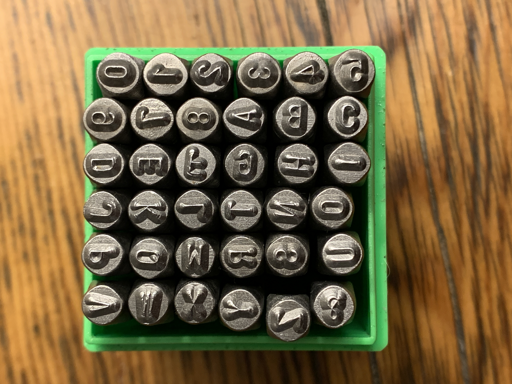
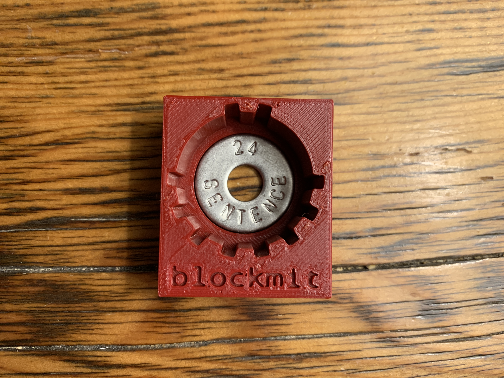
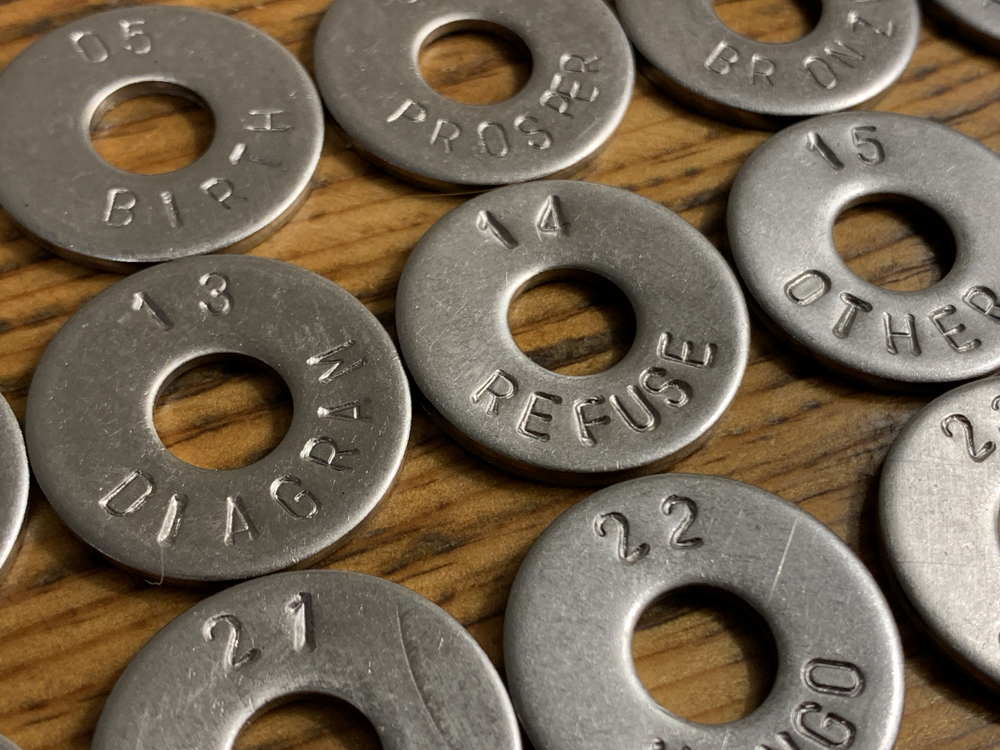
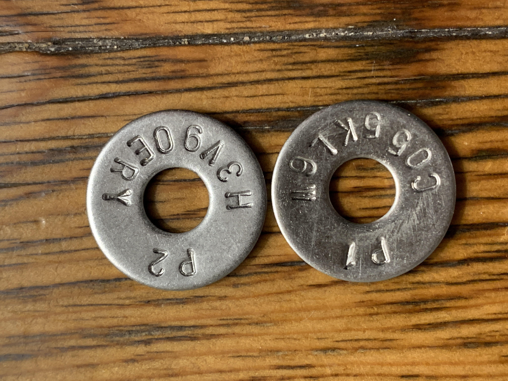
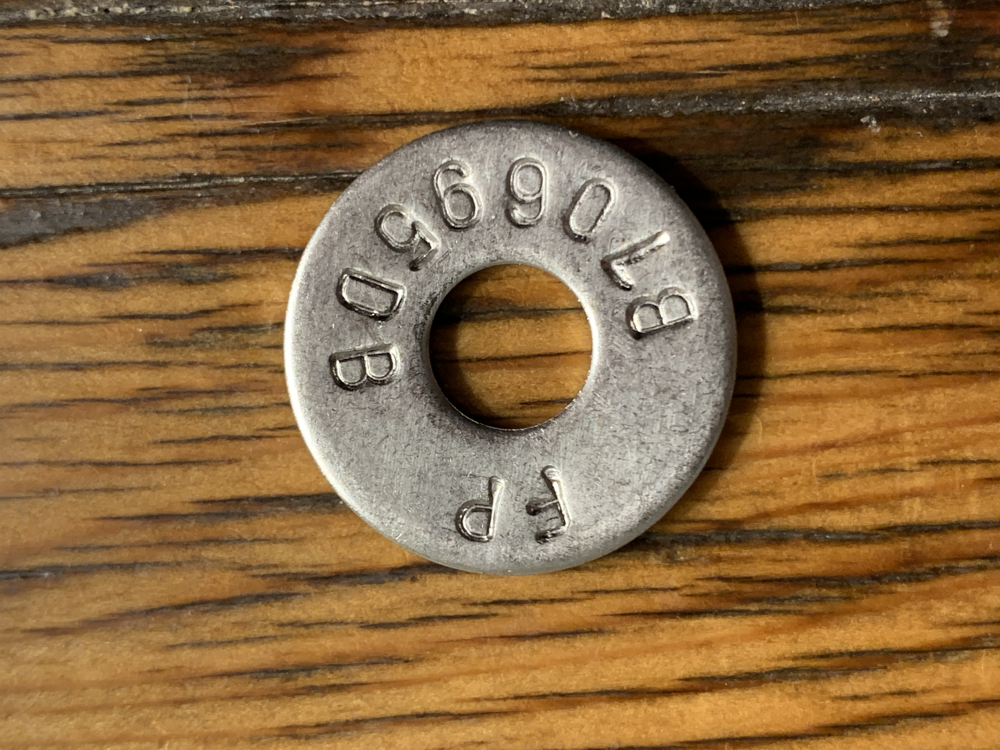
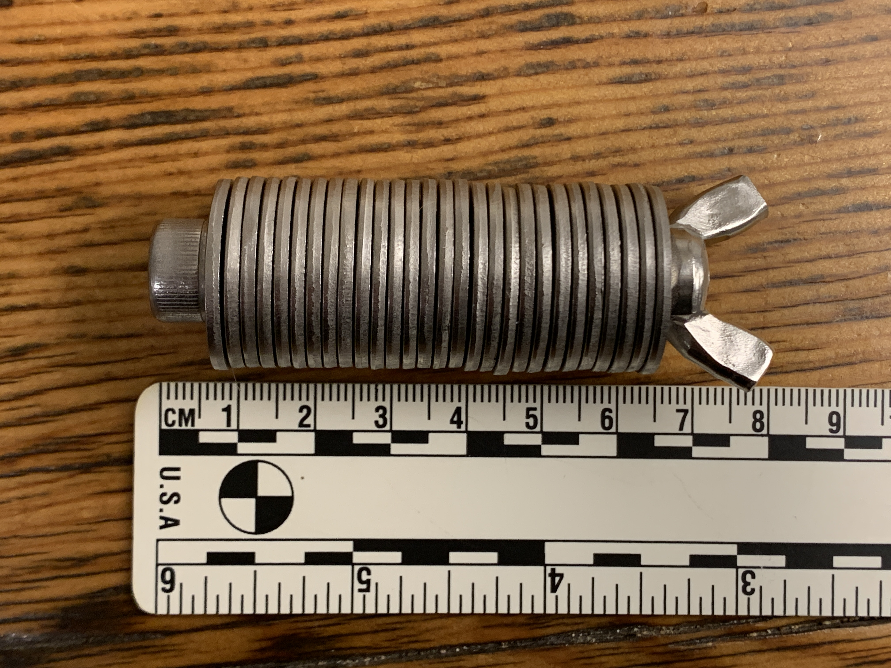

# Stamping the Seed Phrase & Passphrase into Steel
Next, the 24-word seed phrase, the BIP39 passphrase, and the wallet fingerprint can be stamped into stainless steel washers for a simple backup that can withstand fire, flooding, and other harsh environments. Having a robust backup helps ensure that in the event the ColdCard is lost or stolen that the wallet can still be restored later from the information stamped into the backup washers. 

To help with this, [Blockmit](https://twitter.com/blockmit_com) came up with a really cool idea for a 3D printed jig. This jig allows the user to center the washer and the stamps in a clean way that keeps everything uniform and legible. Be sure to check out Blockmit's guide on using this jig [here](https://twitter.com/blockmit_com). Thank you to [@Multicripto](https://twitter.com/Multicripto) for originally bringing this awesome idea to my attention. 

If you don't have a 3D printer, you can purchase these jigs from [CryptoCloaks](https://twitter.com/CryptoCloaks) on their website [here](https://www.cryptocloaks.com/product/blockmitjig/).

Make sure to source all the materials correctly, this jig was designed to use metric hardware. It is recommended to use double sided tape to keep the washers and jig aligned while stamping, but I didn't use any double sided tape and I was still very pleased with the results. My son helped supervise me to make sure I got the stamping done right.

Once finished, you will have a robust stainless steel backup of your 24-word seed phrase.

