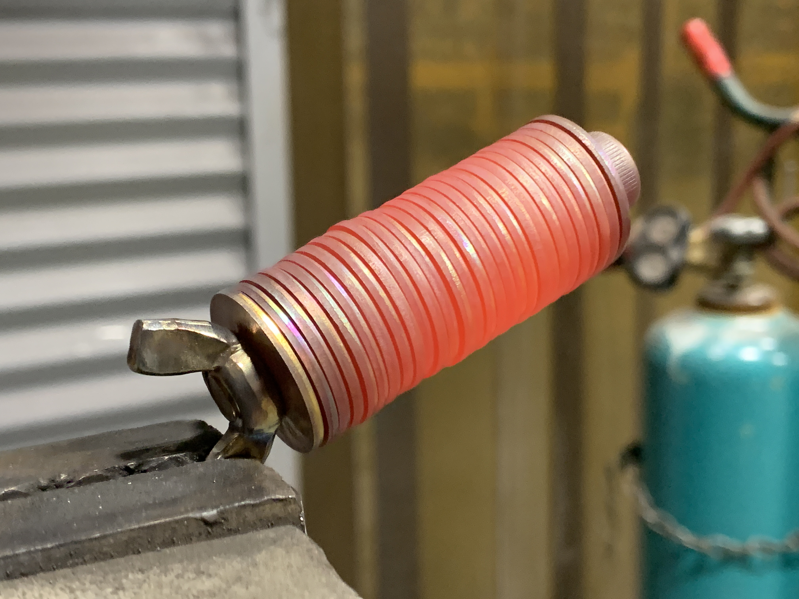

# Fire & Water Testing the Steel Backup
I was curious how well a stainless steel washer backup would be able to withstand extreme heat. So I heated up the backup until it was white hot and just starting to melt. Then took the washers apart and found that they were all still totally legible. 

[insert video]

Then I decided to mix up some salt-water and throw the backup into the jar, I'm planning on letting it sit in the salt-water until Christmas (40 days) and then I'll open it and see if any corrosion has occurred. I'm not expecting much, since it is stainless steel, but I will post the results here at that time anyways. 

### 40 Days Later...

After sitting in the salt-water mix for 40 days, I opened the jar on Christmas day. The stainless steel backup was rinsed off with fresh water and then taken apart and the individual washers were dried out. As I suspected, since this is stainless steel, there was no sign of deterioration. The information was still fully legible and the seed phrase was still 100% recoverable. 

Thank you for reading! I hope this got you thinking about backing up your seed phrases with stainless steel washers. Self-custody is a way to interact with Bitcoin in a way that protects the user from the downfalls of third parties. There are tradeoffs to all choices, but I hope this made you realize that self-custody can be easy and is not frightening. 

If you enjoyed this content, leave me a tip here: Donate.

This article can be found on Twitter as a thread here.
