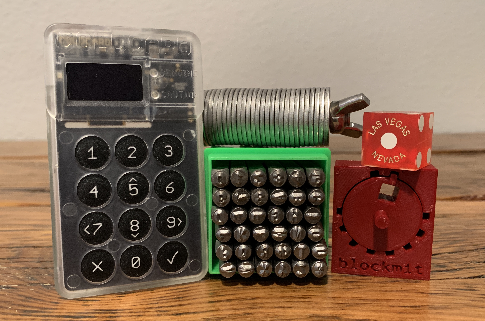

# Don't take chances rolling the dice.
An article on verifying ColdCard firmware, generating a 24-word seed phrase with dice, verifying the dice rolls, backing up the seed with a 3D printed Blockmit jig, and stress testing the backup.

Having a reliable backup of a seed phrase is an important part of self-custody. There are many ways to backup a seed phrase, but there is no way to get bailed out if the backup is lost or damaged beyond recognition. This level of radical responsibility can be shocking to some people; there is no Bitcoin customer support desk, or Bitcoin chargebacks, or Bitcoin card-lock feature, those who are righteous enough to take custody into their own hands take the full responsibility of their Bitcoin with them. 

So why would someone be crazy enough to self-custody their bitcoin, with all the pitfalls, scams, & hackers? Wouldn't people be better off just leaving custody to the pros? The short answer is "no", the long answer is "fuck no!". In this article, I aim to demonstrate how to create and verify a simple, robust, and inexpensive backup so that you can rest assured that  your bitcoin is better off in your hands, not the custodians.

Self-custody is an important aspect of censorship-resistance. Self-custody enables a person to interact with the world however they choose. Because of censorship-resistance, people  have the freedom to donate to any cause they find value in, obtain goods & services that may not align with a banker's vision of the world, and secure their wealth in a manner that mitigates confiscation. There are several disadvantages when a person hands over control of their bitcoin to someone else:

- Creates a permissioned relationship; the owner needs to ask the controller to send payment or make a trade or send the funds elsewhere. Permissioned relationships are problematic in that the controller, not the owner, has final say over how the bitcoin is used. This enables the controller  to decide what is an appropriate use of the owner's funds, and if the controller doesn't like Wikileaks, for example, then the owner's donation won't be processed. Or if the controller doesn't like marijuana, then the owner may not be able to procure valuable medication. Through overreaching regulations, the government forces the controller to wield the governments vision of the world, forcing their objectives and their morals down the owner's throat. The  controller is incentivized to uphold the government's vision of the world by censoring the owner's transactions, if the controller allows the owner to spend their bitcoin in a manner that is not consistent with government approved activities then the controller may face fines and penalties. The controller may even freeze and seize the owner's bitcoin with little or no explanation. Self-custody ensures the owner has the final say in how their funds are used. As the saying goes, "You don't like our life style, we don't like your laws".
- Introduces counter party risk; what happens to the owner when the controller gets hacked, or mysteriously dies while on honeymoon, or files for bankruptcy? There is no [FDIC](https://www.fdic.gov/resources/deposit-insurance/understanding-deposit-insurance) or [SIPC](https://www.sipc.org/for-investors/introduction) insurance on bitcoin, not from any service provider. There is no recourse to ensure the financial safety of the owner in the event the controller doesn't uphold their end of the bargain. There is no way for the owner to know exactly what the controller is doing with the bitcoin. Is it being invested in Yams? Was it just used to send the CEO's kids to spring break? What kind of risk is the owner unknowingly being exposed to by the controller's decisions? Self-custody shields the owner from someone's bad decisions. The controller may only have a fraction of the bitcoin they are "selling" or they may not have any at all, rehypothecation drives down market price as "bitcoin" get's bought & sold without affecting the actual markets.
- Diminishes privacy through KYC; because most controllers in this context would be [Money Services Businesses](https://www.fincen.gov/money-services-business-definition) (MSB), they are required to comply with regulations stemming from the [Bank Secrecy Act](https://www.occ.treas.gov/topics/supervision-and-examination/bsa/index-bsa.html). These regulations stipulate that certain information must be collected from customers and that this information must be used in certain ways to inform the regulators and law enforcement about certain activities. The triggers and thresholds for which activities need to be reported are continuously becoming more minuscule and invasive, the most [recent proposed rule change](https://www.econoalchemist.com/post/fincen-fatf-purposed-travel-rule-changes) would require MSB's to automatically file a suspicious activity report on any customer sending $250.00 or more in bitcoin across a US border. I don't know about you, but to me, being reported to federal regulators and/or law enforcement for using Bitcoin to move $250.00 outside the US just defeats the purpose of Bitcoin. It's important to note that once a person uses a KYC service to obtain bitcoin, then there will be permanent record of that person buying X amount of bitcoin on Y date. Even if the person tries to take responsibility and self-custody their bitcoin, MSB's have record of that person possessing control of certain bitcoin address. Tracing bitcoin movements throughout the network is commonplace, so it is difficult for a person to disassociate their identity from their Bitcoin activity. Even if this isn't known publicly, it is known by someone who won't hesitate for a second to share that information if asked by law enforcement. Considering how the laws have changed in less than a year, making it a crime to gather in groups, go outdoors without a mask, and stand closer than 6ft to another person, it's becoming easier by the day to be classified as a criminal for leading a normal life. If you can't see how ever-encroaching laws will wind up turning your normal behavior into illegal activity sooner than later, then maybe censorship-resistant money isn't for you. Self-custody protects the owner from triggering suspicious activity reporting, non-KYC bitcoin assists the owner in remaining unidentified.
   
